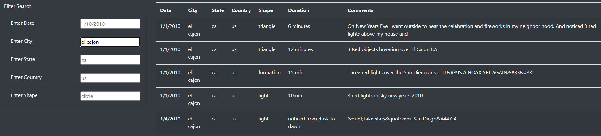
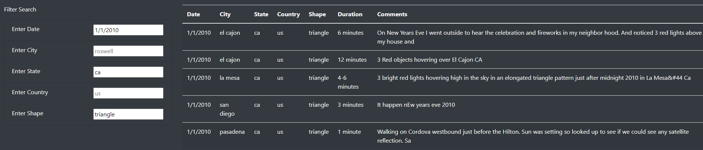

# UFOs—The Truth Is Out There

## Overview
Using HTML (with Bootstrap) and JavaScript (with D3), create a Web page that dynamically filters UFO sighting data based on user-supplied criteria.

## Results
The page is relatively straightforward, containing a [fairly long list](./static/images/full_list.png) of UFO sightings.

[Details on the page's use follow, with several images provided in-line, to demonstrate and clarify the page's use. In order to prevent this document from becoming too cluttered, though, other images can instead be accessed via links in the text.]

### Limiting the Results

#### Single-value Filters

The list can be made more manageable by entering values into any of the filter fields that appear on the page.

By date of sighting…

…by city…

…or by [state](./static/images/filtered_by_state.png), [country](./static/images/filtered_by_country.png), or [shape](./static/images/filtered_by_shape.png). [Click the links at left to see images of filtered examples.]

#### Multi-valued filters

Users can also enter values into multiple fields, and the page will return results that satisfy each of the given criteria:

## Summary
Although the page can easily pare down the data if the user knows specifically what to look for, there are several notable limitations to it, at present.

1. The filters can only check for exact matches.
   - A partial match is insufficient. So if, for example, a user enters [west]() into the City field, it will return no matches, despite the presence of cities [west boylston](./static/images/west_boylston.png) and [westbrook](./static/images/westbrook.png) appearing in the list.
   - A difference in capitalization counts as a different filter. [West Boylston](./static/images/West_Boylston_proper_case.png), for example, returns no results, while [west boylston](./static/images/west_boylston.png), on the other hand, returns 1 result.
2. Multiple filters are read as `AND` only; it is not possible to filter, for example, for sightings in the state of Arkansas (ar) `OR` in the country of Canada (ca).

It shouldn't be too difficult to deal with the upper- / lowercase problem. There are many ways to convert the user's input to lowercase before sending it to the filter, behind the scenes, which would handle the issue fairly easily.

The `AND`/`OR` problem can also be handled without too much trouble. It will involve adding another control to the page—some kind of "switch" that the user can toggle depending on whether `AND`- or `OR`-behavior is desired. The internal filtering mechanism will also have to change a little. Currently, with each new filtering criterion, the page just removes all those rows that don't apply. In `OR` mode, though, the code will have to work through some Boolean logic regarding the several filters selected before actually applying the filter.

Use of a [regular expression](https://www.regular-expressions.info/) engine could also handle the problems with partial matches, and it could also allow filtering on the Duration and Comments columns, which is currently not possible.